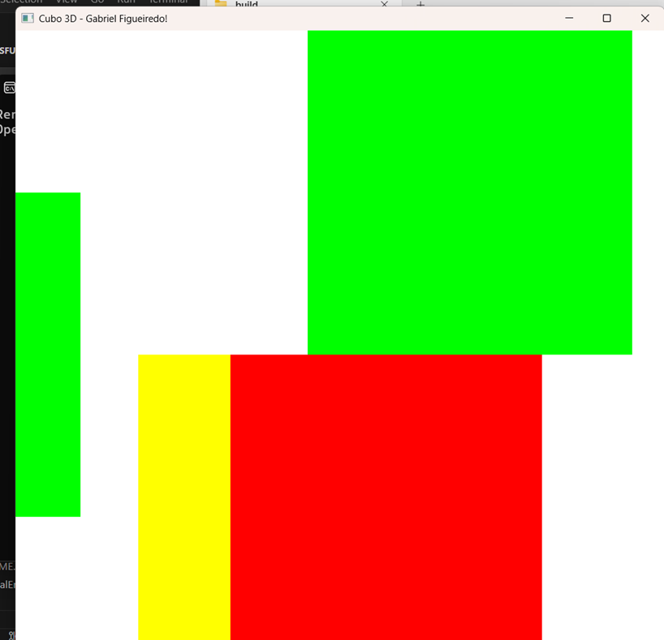
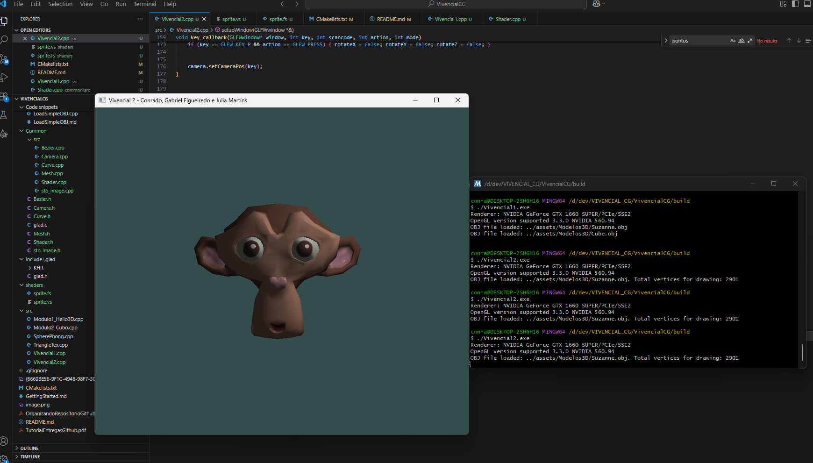
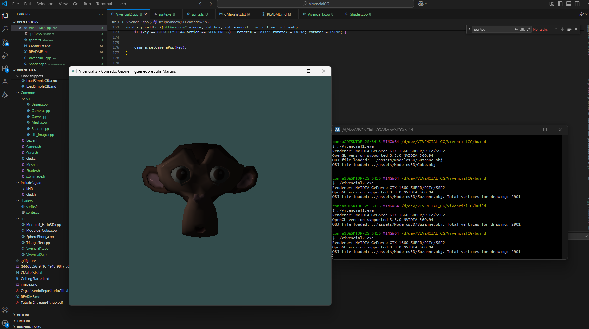
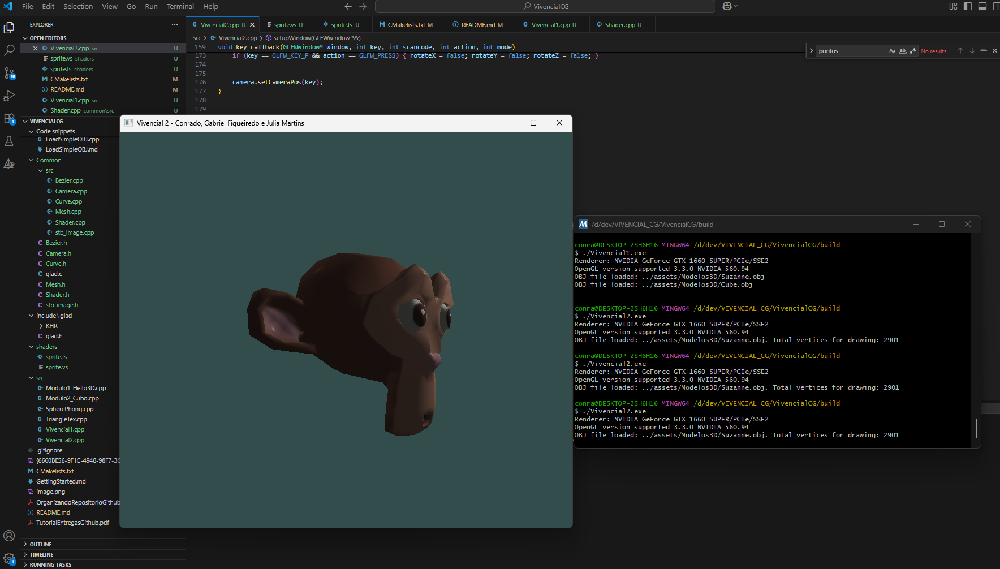

# VivencialCG
Repositório das atividades vivenciais para Computação Gráfica

Grupo: Conrado Maia, Gabriel Figueiredo e Júlia Martins

## Modulo 2: Modulo2_Cubo.cpp

Teclas:

- R: Rotaciona 
- A, D: Direita e esquerda 
- I,K: Cima baixo 
- W,S: frente, tras 
- ´,[: Dimensoes.
´
### Aplicativo:

## Vivencial 2

